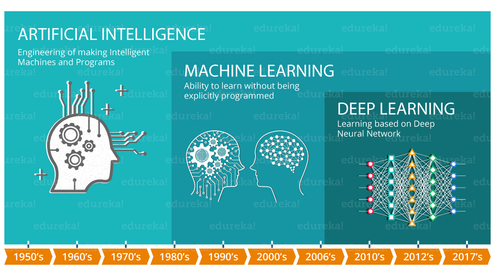

class: class: center, middle


<!-- css: [default, duke-blue, hygge-duke] -->

```{r setup, echo=FALSE}
options(htmltools.dir.version = FALSE)
xaringanExtra::use_logo('www/channels4_profile-removebg-preview.png')
```

```{r include=FALSE}
library(dplyr)
knitr::opts_chunk$set(warning = FALSE, message = FALSE)
```

```{css, echo = F}
.regression table {
  font-size: 12px;     
}

.dataTables_info{
  font-size: 10px;
}

.dataTables_paginate{
  font-size: 10px;
}

.dataTables_length{
  font-size: 10px;
}
```


# Machine Learning

---

# Machine Learning - Concepts

- Machine Learning (ML) is a subset of Artificial Intelligence (AI)
- Algorithms that can improve automatically through experience and by the use of data without being explicit programmed, reason why we say that the algorithms learn.
- With ML algorithms we can build a model to make predictions or decisions.
- Machine learning algorithms are used many different applications, for example:
  - Medicine
  - Email filtering
  - Speech recognition
  - Computer vision

{width=50px}

---

class: center, middle
background-image: url(www/machine-learning.png)
background-size: contain

---

class: center, middle

# Supervised Learning

---

# Supervised Learning

**Supervised learning** is where you have input variables (x) and an output variable (Y) and you use an algorithm to learn the mapping function from the input to the output.

<center> Y = f(x) </center>

- It is the most common type of Machine Learning problem

- It is called **supervised** because we have the label that tell us the correct information, and we are going to be corrected if we predict wrong.

- Supervised learning can be grouped into two problems:
  - **Regression:** The output variable is a real number, for example, weight
  - **Clustering:** The output variable is a category, for example, disease and no disease 
  
---

# Steps

To solve this kind of problem we have some steps to follow:

1. Data collection
2. Exploratory Data Analysis (EDA)
3. Data Processing
4. Data Modelling

I am going to briefly explain each of these steps that will be clarified when we have the example.

---

# Data Collection

Data is very important for building a Machine learning model, as the model will learn from the dataset provided.

Collecting, **cleaning** and managing your data properly is a key factor for any ML project.

<center><p style="color:red">Garbage in, Garbage out</p></center>

# Exploratory Data Analysis

Understand the characteristics and distribution of the data to help us understand what kind of model and what type of learning we are dealing with.

---

# Data Preprocessing or Feature Engineering

If the dataset is not good and if there are missing values, outliers, or the features are not presented in a corrected format, the ML model built from this data will probably be bad. 

Some methods are usually used: encoding, normalization, imputation, outliers and NaN rejections, variable selection

## Encoding

**Encoding** is a method to transform the categorical data into numbers before using it to fit the model. For example, if we have the categories "cat" and "dog" we can encode them to 0 and 1.

---

## Normalization

Some ML models need to be on the "same range" to fit the data properly without the addition of bias due to different scales. For example, if we have as features height as 150cm and salary as 40000, salary might be more important due to potentially being in the 1000's but that's not necessarily true.

Methods to normalise: 
- **Min-max:** rescales the range of features to the new range in [0,1]
$$X_{normalised} = \frac{X - min(X)}{max(X) - min(x)}$$
- **Standardisation (Z-score normalisation):** Rescale the feature in a new range with a zero mean and a standard deviation is 1
$$X_{normalised} = \frac{X - \bar{X}}{\sigma_X}$$

---

## NA 

When we have NAs on the data, it means that the data is Not Available, i.e., we have missing information. In this case we can:
- *Remove* the missing data
  - If enough data available
  - If the missing data does not have a pattern, i.e., is random
- *Inputation*: input the missing data using some statistical method
  - Use the mean or median of the variable to input missing values
  - Apply some algorithm, for example, linear or logistic regression to determine the likely value

## Variable selection

Select the most relevant variables for the model. This can be used to:
- Simplify the model
- Reduce overfitting
- Reduce training time

---

# Data Modelling

## Split the data

Before applying the model we need to make sure that we have a dataset to train and evaluate the model and another one to test the accuracy of the model.

We need to have different datasets to train and test the model because we want the model to learn and be able to **generalise on unseen data**. If we use the same dataset for training and testing, we are "leaking" information to the test and we can't garantee that the model can generalise. Also, having this split help us with problems like **overfitting** and **underfitting**.

The splits of the data usually are:
- Training
- Validation
- Testing

We usually split the data into 80% for training, 10% for validation and 10% for testing.

---

### Training set

It is the set of data that is used to train and make the model learn the hidden features/patterns in the data.

It should be large enough so that the model can “learn” correctly. Most of the data is used for training.

### Validation Set

This set is used to validate our model performance during training. This validation process gives information that helps us tune the model’s hyperparameters and configurations accordingly. 
- It tell us if the training is moving in the right direction or not.

The main idea of splitting the dataset into a validation set is to prevent our model from **overfitting** i.e., the model becomes really good at classifying the samples in the training set but cannot generalize and make accurate classifications on the data it has not seen before. 

### Test set

It tests the model after completing the training by providing an unbiased final model performance metric in terms of accuracy, precision, etc. 
- It answers the question: "How well does the model perform?"

---

## Modelling and evaluating the model

There are various machine learning models that you can choose according to the objective, for example, Linear Regression, Support Vector Machine (SVM), Decision Tree, Random Forest, K-Nearest Neighbors, Neural Network, K-means, etc.

We will see some of them when going through the examples.

Once we train the model, we need to evaluate it. Depending of your supervised learning problem, we have different metrics:
- **Classification metrics:** accuracy, ROC curve, confusion matrix
- **Regression metrics:** Mean Absolute Error, Mean Squared Error (MSE), Root Mean Square Error (RMSE), $R^2$ metric.

## Prediction

When the best model is determined, it can be used to predict the new samples on the testing set.

---

class: center, middle

# Regression

---

# Regression

**Regression** is a type of **supervised** learning. One example of algorithm that we can use for this kid of problem is a **Linear Regression**.

- Yes, it is the same Linear Regression as previos seem
  -  In general, ML doesn't seem to make many statistical assumptions about the data.
  
To explain how to solve a Regression problem, I am going to use the dataset *Medical insurance costs*. The data contains medical information and costs billed by health insurance companies. It contains 1338 rows of data and the  columns: age, gender, BMI, children, smoker, region as features and insurance charges as the label.

I am going to use the R libraries `tidyverse` and `tidymodels`. 
- `tidymodels` is a library for machine learning workflow

---

# Regression example - Data collection

The first step is to collect the data. The data is available at github and the link can be seen on the example.

```{r}
# Load libraries
library(tidyverse)
library(tidymodels)

# Load data sets
url <- 'https://raw.githubusercontent.com/stedy/Machine-Learning-with-R-datasets/master/insurance.csv'
insurance <- read_csv(url)
```

We can see some of the data by using `glimpse`. We can see that we have 1338 rows and 7 columns. Also, `sex`, `smoker` and `region` are characters that will be transformed to factors.

```{r}
glimpse(insurance)
```

---

# Regression example - EDA

I'll be using the package `dlookr` to help us with the EDA. We are displaying:
- na: Number of NA values
- mean, standard deviation and IQR 
- p00: min value; p25: 1st quartile; p50: median; p75: third quartile; p100: max value

```{r}
library(dlookr)
library(DT)
dlookr::describe(insurance, quantiles = c(0, 0.25, 0.5, 0.75, 1),
                 statistics = c("na", "mean", "sd", "IQR", "quantiles")) %>%
  DT::datatable(rownames = FALSE, options = list(dom = 't',scrollX = TRUE, scrollCollapse = TRUE))
```


---

# EDA - Sex

```{r}
insurance %>% 
  group_by(sex) %>% 
  describe(quantiles = c(0, 0.25, 0.5, 0.75, 1),
           statistics = c("mean", "sd", "IQR", "quantiles")) %>%
  DT::datatable(rownames = FALSE, options = list(autoWidth = TRUE, dom = 't',scrollX = TRUE))
```

---

# EDA - Smoker

```{r}
insurance %>% 
  group_by(smoker) %>% 
  describe(quantiles = c(0, 0.25, 0.5, 0.75, 1),
           statistics = c("mean", "sd", "IQR", "quantiles")) %>%
  DT::datatable(rownames = FALSE, options = list(autoWidth = TRUE, dom = 't',scrollX = TRUE, scrollY = "300px"))
```

---

# EDA - Region

```{r}
insurance %>% 
  group_by(region) %>% 
  describe(quantiles = c(0, 0.25, 0.5, 0.75, 1),
           statistics = c("mean", "sd", "IQR", "quantiles")) %>%
  DT::datatable(rownames = FALSE, options = list(autoWidth = TRUE, scrollX = TRUE, scrollY = "300px"))
```

---

# EDA - correlation

```{r}
correlate(insurance) %>%
  plot()
```

---

# Regression example - Feature engineering

We need to transform the characters values to factors.

```{r}
insurance <- insurance %>%
  mutate_if(is.character, as.factor)

glimpse(insurance)
```

Ordinary least squares is invariant to the scale of numerical variables, while methods such as lasso or ridge regression are not. 
- For invariant methods there is no real need for standardisation
- For non-invariant methods you should standardise. 

---

# Regression - Data Splitting

We will be using the `initial_split()` function to partition the data into training and test sets. The main arguments of the function are: `data` and `prop` that represents the training split proportion.
  - The split will be 80/20 for training/test.

After creating the partition, we need to apply the `training()` and `testing()` functions to have the partitions.

> Remember to always use `set.seed()` to ensure your results are reproducible.

```{r}
set.seed(88)

# create split object
insurance_split <- initial_split(insurance, prop = 0.8)

# Build training data set
insurance_train <- insurance_split %>% training()
cat("Insurance train dimension:", nrow(insurance_train), "rows and", ncol(insurance_train), "columns")

# Build testing data set
insurance_test <- insurance_split %>% testing()
cat("Insurance test dimension:", nrow(insurance_test), "rows and", ncol(insurance_test), "columns")
```

---

# Regression - Modelling

The next step in the process is to build a linear regression model to fit our training data.

For every model type, such as linear regression, there are numerous packages (or *engines*) that can be used.

For example, we can use the `lm()` function from base R or the `stan_glm()` function from the `rstanarm` package. Both of these functions will fit a linear regression model to our data with slightly different implementations.

The `parsnip` package from `tidymodels` acts like an aggregator across the various modeling engines within R. This makes it easy to implement machine learning algorithms from different R packages with one unifying syntax.

To specify a model object with parsnip, we must:

1. Pick a model type
2. Set the engine
3. Set the mode (either regression or classification)

---

# Regression - Modelling

Linear regression is implemented with the `linear_reg()` function in `parsnip`. To the set the engine and mode, we use `set_engine()` and `set_mode()`.

Let’s create a linear regression model object with the `lm` engine. 
- This is the default engine for most applications.

```{r}
lm_model <- linear_reg() %>% 
            set_engine('lm') %>% # adds lm implementation of linear regression
            set_mode('regression')

# View object properties
lm_model
```

---

# Regression - Fit model to data

We can fit the model by using the `fit()` function from `parsnip`. The function has the following arguments:
- parnsip model 
- model formula
- data frame with the training data

In our formula, we have specified that `charges` is the response variable and age, sex, bmi, children, smoker and region are our predictor variables.

```{r}
lm_fit <- lm_model %>% 
          fit(charges ~ ., data = insurance_train)

# View lm_fit properties
lm_fit
```

---

# Regression - Exploring the model

To obtain the results from our trained model in a data frame, we can use the `tidy()` and `glance()` functions from the `broom` package.

The `tidy()` function takes a linear regression object and returns a data frame of the estimated model coefficients and their associated F-statistics and p-values.

```{r}
library(broom)
tidy(lm_fit) # Data frame of estimated coefficients
```

---

# Regression - Exploring the model

The `glance()` function returns performance metrics obtained on the training data such as the R2 value (r.squared) and the RMSE (sigma).

```{r}
# Performance metrics on training data
glance(lm_fit)
```

---

# Regression - Predict on the test set

To assess the performance of the model, we must use the test set to predict the charge value and then compare to the real value.

This is done with the `predict()` function from `parnsip`. This function takes two important arguments:
- Trained parnsip model 
- new_data to generate predictions

It’s best to combine the test data set and the predictions into a single data frame.

```{r}
insurance_test_results <- predict(lm_fit, new_data = insurance_test) %>% 
                            bind_cols(insurance_test)

# View results
insurance_test_results %>% head()
```

---

# Regression - Evaluate the model

To evaluate the model, I'll use RMSE and $R^2$ that can be obtained by using the functions `rmse()` and `rsq()` functions. Both functions take the following arguments:
- `data`: dataframe with real and predicted values
- `truth`: column with the real labels
- `estimate`: columns with the predictions

```{r}
# RMSE on test set
rmse(insurance_test_results, truth = charges, estimate = .pred) %>%
  # R2 on the test set
  bind_rows(rsq(insurance_test_results, truth = charges, estimate = .pred))
```

The closes to zero the RMSE value is the best your model is, and we can see that the RMSE of this model is very high, which indicates that this model is not a very good model to predict insurance charges.

---

# Regression - Plot R2

.pull-left[

We can visualise the fit of the model by plotting the $R^2$.

```{r eval=FALSE, include=TRUE}
ggplot(data = insurance_test_results,
       mapping = aes(x = .pred, y = charges)) +
  geom_point(color = '#006EA1') +
  geom_abline(intercept = 0, 
              slope = 1, 
              color = 'orange') +
  labs(title = 'Linear Regression Results - 
       Insurance Test Set',
       x = 'Predicted Insurance Value',
       y = 'Actual Insurance Value')
```
]

.pull-right[
```{r echo=FALSE}
ggplot(data = insurance_test_results,
       mapping = aes(x = .pred, y = charges)) +
  geom_point(color = '#006EA1') +
  geom_abline(intercept = 0, slope = 1, color = 'orange') +
  labs(title = 'Linear Regression Results - Insurance Test Set',
       x = 'Predicted Insurance Value',
       y = 'Actual Insurance Value')
```
]


---

# Reference

https://github.com/stedy/Machine-Learning-with-R-datasets/blob/master/insurance.csv


